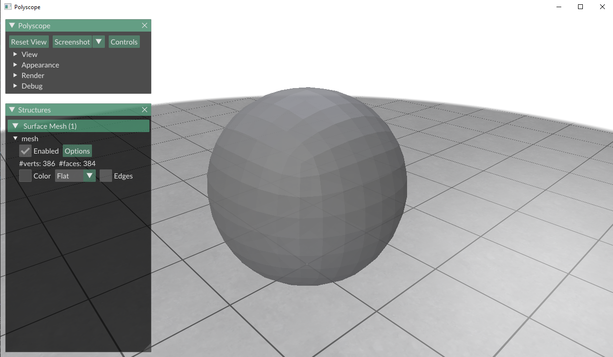
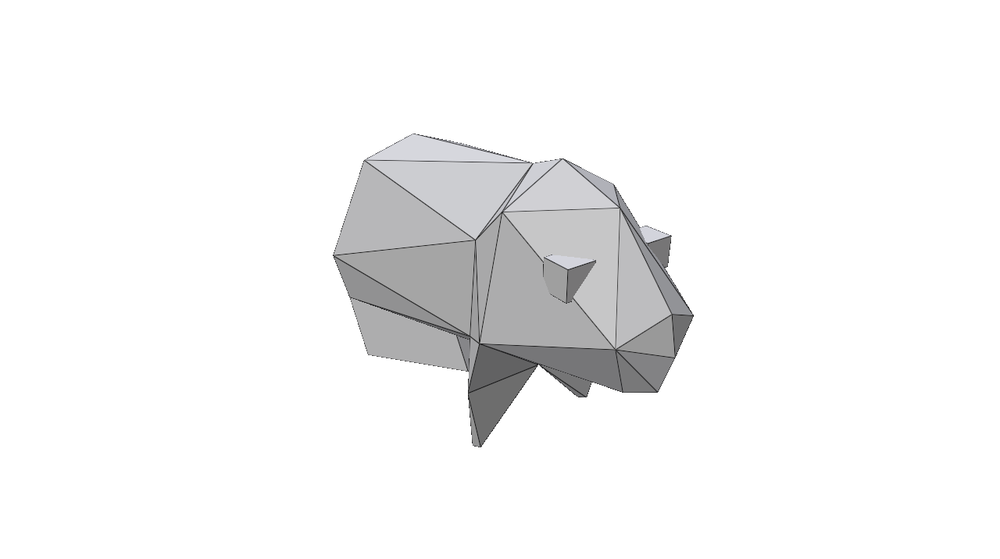
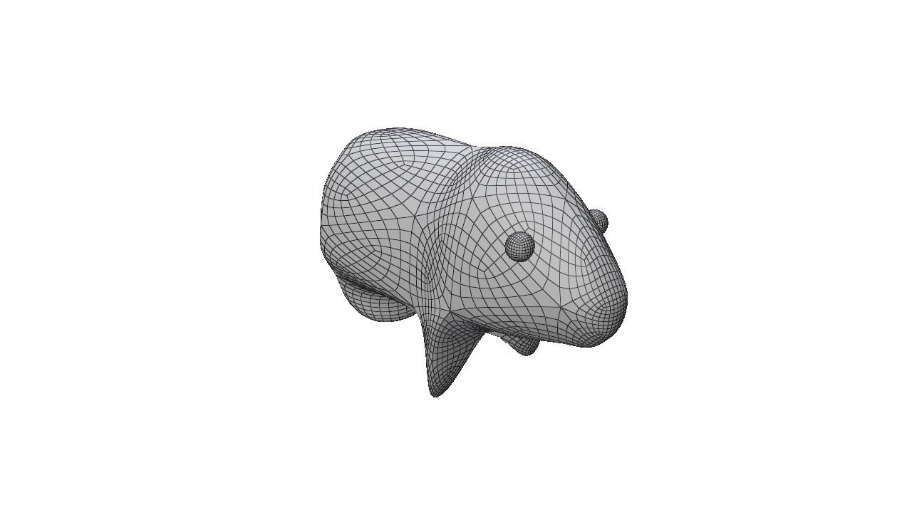

# Subdivision de surface

Ce programme python utilise la bibliothèque polyscope et applique l'algorithme de subdivision de surface catmull-clark.

Ici, on a un cube subdivisé 3 fois.

On peut également subdiviser des modèles 3d au format .obj :

---

---

---